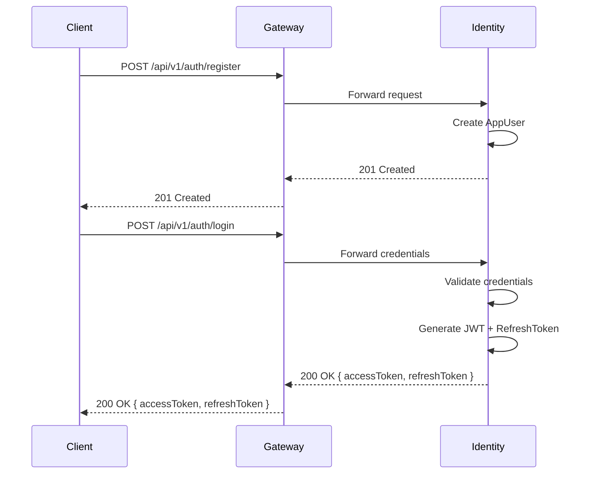
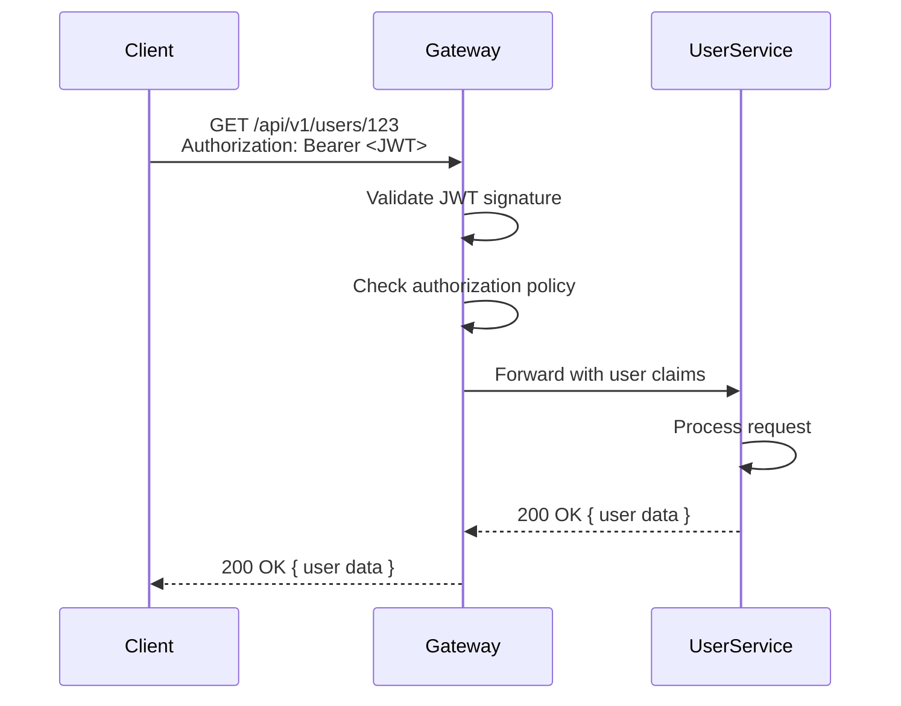
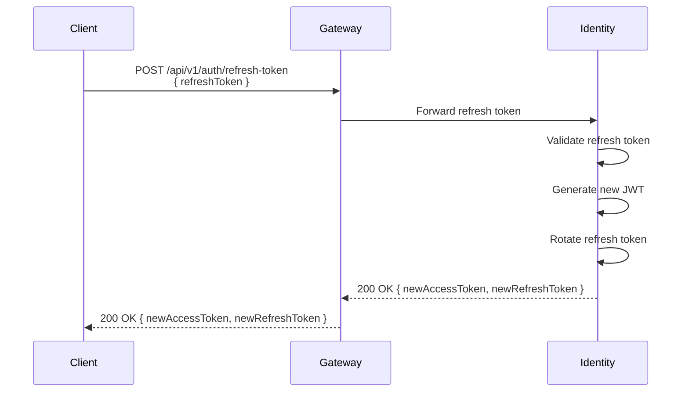

# 🌐 TaskFlow API Gateway Guide

**Version**: 1.0
**Last Updated**: 2025-11-04
**Technology**: YARP (Yet Another Reverse Proxy) + JWT Authentication

---

## 📋 Table of Contents

1. [Overview](#overview)
2. [Architecture](#architecture)
3. [Security Features](#security-features)
4. [API Routes & Versioning](#api-routes--versioning)
5. [Authentication Flow](#authentication-flow)
6. [Configuration](#configuration)
7. [Local Development](#local-development)
8. [Testing](#testing)
9. [Production Deployment](#production-deployment)

---

## 🎯 Overview

The TaskFlow API Gateway serves as the **single entry point** for all client requests to the microservices ecosystem. It provides:

- ✅ **Unified API Surface** - Single URL for all services
- ✅ **JWT Authentication** - Centralized token validation
- ✅ **Authorization Policies** - Role-based access control
- ✅ **Rate Limiting** - Protect services from abuse
- ✅ **CORS Management** - Secure cross-origin requests
- ✅ **Load Balancing** - Distribute traffic across instances
- ✅ **Health Checks** - Monitor downstream services
- ✅ **Request Tracing** - Correlation IDs for debugging
- ✅ **Security Headers** - OWASP best practices

---

## 🏗️ Architecture

```
┌─────────────────────────────────────────────────────────────────┐
│                        CLIENT APPLICATIONS                       │
│              (Web, Mobile, Desktop, API Consumers)              │
└─────────────────────────────────────────────────────────────────┘
                                ▼
┌─────────────────────────────────────────────────────────────────┐
│                    🌐 API GATEWAY (YARP)                         │
│  ┌────────────────────────────────────────────────────────────┐ │
│  │  Security Middleware                                        │ │
│  │  ├─ CORS                                                    │ │
│  │  ├─ Rate Limiting (100 req/min)                            │ │
│  │  ├─ JWT Authentication                                      │ │
│  │  ├─ Authorization Policies                                  │ │
│  │  ├─ Security Headers (HSTS, CSP, XSS Protection)           │ │
│  │  └─ Request ID Generation                                   │ │
│  └────────────────────────────────────────────────────────────┘ │
│                                                                  │
│  ┌────────────────────────────────────────────────────────────┐ │
│  │  Routing & Load Balancing                                   │ │
│  │  ├─ /api/v1/auth/* → Identity Service                      │ │
│  │  ├─ /api/v1/identity/* → Identity Service (Auth Required)  │ │
│  │  ├─ /api/v1/users/* → User Service                         │ │
│  │  ├─ /api/v1/tasks/* → Task Service                         │ │
│  │  ├─ /api/v1/admin/* → Admin Service                        │ │
│  │  └─ /api/v1/notifications/* → Notification Service         │ │
│  └────────────────────────────────────────────────────────────┘ │
└─────────────────────────────────────────────────────────────────┘
            ▼              ▼              ▼              ▼
    ┌─────────────┐ ┌─────────────┐ ┌─────────────┐ ┌─────────────┐
    │  Identity   │ │    User     │ │    Task     │ │   Admin     │
    │   Service   │ │   Service   │ │   Service   │ │   Service   │
    │  (Port 8080)│ │  (Port 8081)│ │  (Port 8082)│ │  (Port 8083)│
    └─────────────┘ └─────────────┘ └─────────────┘ └─────────────┘
```

---

## 🔐 Security Features

### 1. JWT Authentication

**Configuration**: `appsettings.json` → `JwtSettings`

```json
{
  "JwtSettings": {
    "SecretKey": "TaskFlow-Super-Secret-Key-Change-In-Production-Min-32-Chars!!!",
    "Issuer": "TaskFlow.ApiGateway",
    "Audience": "TaskFlow.Services",
    "ExpirationMinutes": 15,
    "RefreshTokenExpirationDays": 7,
    "ValidateIssuer": true,
    "ValidateAudience": true,
    "ValidateLifetime": true,
    "ValidateIssuerSigningKey": true,
    "ClockSkew": "00:05:00"
  }
}
```

**How it works**:
- Client logs in via `/api/v1/auth/login` → Identity Service
- Identity Service returns JWT access token + refresh token
- Client includes token in `Authorization: Bearer <token>` header
- Gateway validates token signature and claims
- Gateway forwards authenticated requests to downstream services

### 2. Authorization Policies

**Defined Policies**:
- `authenticated` - Requires valid JWT token
- `admin` - Requires Admin or SuperAdmin role
- `superadmin` - Requires SuperAdmin role only

**Usage in Routes**:
```json
{
  "identity-appusers-route": {
    "ClusterId": "identity-service",
    "Match": { "Path": "/api/v1/identity/appusers/{**catch-all}" },
    "AuthorizationPolicy": "authenticated"
  }
}
```

### 3. Security Headers

Automatically added to all responses:

| Header | Value | Purpose |
|--------|-------|---------|
| `X-Content-Type-Options` | `nosniff` | Prevent MIME sniffing |
| `X-Frame-Options` | `DENY` | Prevent clickjacking |
| `X-XSS-Protection` | `1; mode=block` | Enable XSS filter |
| `Referrer-Policy` | `no-referrer` | Hide referrer |
| `Permissions-Policy` | `geolocation=()...` | Disable browser features |
| `Strict-Transport-Security` | `max-age=31536000` | Force HTTPS (prod only) |
| `X-Request-Id` | `<guid>` | Request tracing |

### 4. Rate Limiting

**Configuration**: `appsettings.json` → `RateLimiting`

```json
{
  "RateLimiting": {
    "Enabled": true,
    "PermitLimit": 100,
    "Window": "00:01:00",
    "QueueLimit": 10
  }
}
```

- **100 requests per minute** per user/IP
- **10 requests queued** if limit exceeded
- **429 Too Many Requests** returned when over limit

### 5. CORS Configuration

**Development**:
```json
{
  "Cors": {
    "AllowedOrigins": ["http://localhost:3000", "http://localhost:5173"],
    "AllowedMethods": ["GET", "POST", "PUT", "DELETE", "PATCH", "OPTIONS"],
    "AllowedHeaders": ["Content-Type", "Authorization", "X-Request-Id"],
    "AllowCredentials": true
  }
}
```

**Production**: Restrict to your actual frontend domains!

---

## 🛣️ API Routes & Versioning

### Route Structure

All routes follow the pattern: `/api/v{version}/{resource}/{action}`

**Current Version**: `v1`

### Identity Service Routes

| Method | Path | Auth | Description |
|--------|------|------|-------------|
| POST | `/api/v1/auth/register` | ❌ | Register new user |
| POST | `/api/v1/auth/login` | ❌ | Login (returns JWT) |
| POST | `/api/v1/auth/refresh-token` | ❌ | Refresh access token |
| POST | `/api/v1/auth/logout` | ✅ | Logout (revoke token) |
| POST | `/api/v1/auth/forgot-password` | ❌ | Request password reset |
| POST | `/api/v1/auth/reset-password` | ❌ | Reset password |
| POST | `/api/v1/auth/confirm-email` | ❌ | Confirm email |
| GET | `/api/v1/identity/appusers` | ✅ | List all users (Admin) |
| GET | `/api/v1/identity/appusers/{id}` | ✅ | Get user by ID |
| PUT | `/api/v1/identity/appusers/{id}` | ✅ | Update user |
| DELETE | `/api/v1/identity/appusers/{id}` | ✅ | Delete user (Admin) |

### User Service Routes

| Method | Path | Auth | Description |
|--------|------|------|-------------|
| GET | `/api/v1/users` | ✅ | List users |
| GET | `/api/v1/users/{id}` | ✅ | Get user profile |
| PUT | `/api/v1/users/{id}` | ✅ | Update profile |

### Task Service Routes

| Method | Path | Auth | Description |
|--------|------|------|-------------|
| GET | `/api/v1/tasks` | ✅ | List tasks |
| POST | `/api/v1/tasks` | ✅ | Create task |
| GET | `/api/v1/tasks/{id}` | ✅ | Get task |
| PUT | `/api/v1/tasks/{id}` | ✅ | Update task |
| DELETE | `/api/v1/tasks/{id}` | ✅ | Delete task |

### Admin Service Routes

| Method | Path | Auth | Description |
|--------|------|------|-------------|
| GET | `/api/v1/admin/users` | 👑 Admin | Manage users |
| POST | `/api/v1/admin/users/{id}/activate` | 👑 Admin | Activate user |
| POST | `/api/v1/admin/users/{id}/deactivate` | 👑 Admin | Deactivate user |

---

## 🔄 Authentication Flow

### 1. Registration & Login



### 2. Authenticated Request



### 3. Token Refresh



---

## ⚙️ Configuration

### Environment-Specific Settings

TaskFlow Gateway supports multiple configuration layers:

1. **Base**: `appsettings.json`
2. **Environment**: `appsettings.{Environment}.json`
3. **Cloud Provider**: `appsettings.{Provider}.{Environment}.json`
4. **Environment Variables**: Override any setting
5. **Command Line**: Final override

**Example**:
```bash
# Development
appsettings.json
appsettings.Development.json

# AWS Staging
appsettings.json
appsettings.Staging.json
appsettings.Aws.Staging.json

# Azure Production
appsettings.json
appsettings.Production.json
appsettings.Azure.Production.json
```

### Key Configuration Sections

#### Service Discovery (Consul)

```json
{
  "Consul": {
    "Host": "http://consul:8500",
    "ServiceName": "api-gateway",
    "ServiceId": "api-gateway-1",
    "ServiceAddress": "http://api-gateway",
    "ServicePort": 80,
    "HealthCheckInterval": "00:00:10",
    "DeregisterAfter": "00:01:00"
  }
}
```

#### Health Checks

```json
{
  "ReverseProxy": {
    "Clusters": {
      "identity-service": {
        "HealthCheck": {
          "Active": {
            "Enabled": true,
            "Interval": "00:00:10",
            "Timeout": "00:00:05",
            "Policy": "ConsecutiveFailures",
            "Path": "/health"
          }
        }
      }
    }
  }
}
```

---

## 💻 Local Development

### Prerequisites

- .NET 8.0 SDK
- Docker Desktop (for Consul, RabbitMQ, etc.)

### Running the Gateway

**Option 1: Standalone**
```bash
cd src/ApiGateway/TaskFlow.Gateway
dotnet run --launch-profile "http"
```

**Option 2: With Infrastructure**
```bash
# Start infrastructure (Consul, RabbitMQ, databases)
docker-compose -f docker-compose.infrastructure.yml up -d

# Start Gateway
cd src/ApiGateway/TaskFlow.Gateway
dotnet run
```

**Option 3: Full Stack**
```bash
# Start all services
docker-compose up -d
```

### Local Port Mapping

| Service | Port |
|---------|------|
| API Gateway | 5000 |
| Identity Service | 5006 |
| User Service | 5001 |
| Task Service | 5005 |
| Admin Service | 5007 |
| Notification Service | 5004 |

### Testing Locally

1. **Register a user**:
```bash
curl -X POST http://localhost:5000/api/v1/auth/register \
  -H "Content-Type: application/json" \
  -d '{
    "username": "testuser",
    "email": "test@example.com",
    "password": "Test@1234",
    "firstName": "Test",
    "lastName": "User"
  }'
```

2. **Login**:
```bash
curl -X POST http://localhost:5000/api/v1/auth/login \
  -H "Content-Type: application/json" \
  -d '{
    "emailOrUsername": "testuser",
    "password": "Test@1234"
  }'
```

3. **Use JWT token**:
```bash
TOKEN="<your-jwt-token>"

curl -X GET http://localhost:5000/api/v1/identity/appusers \
  -H "Authorization: Bearer $TOKEN"
```

---

## 🧪 Testing

### Unit Tests

```bash
# Run Gateway tests
dotnet test tests/TaskFlow.Gateway.Tests
```

### Integration Tests

```bash
# Start test environment
docker-compose -f docker-compose.test.yml up -d

# Run integration tests
dotnet test tests/TaskFlow.Gateway.IntegrationTests

# Cleanup
docker-compose -f docker-compose.test.yml down -v
```

### Load Testing

Use [k6](https://k6.io/) or [Apache JMeter]:

```javascript
// k6-load-test.js
import http from 'k6/http';
import { check } from 'k6';

export let options = {
  vus: 100,
  duration: '30s',
};

export default function() {
  const token = '<your-jwt-token>';

  let res = http.get('http://localhost:5000/api/v1/identity/appusers', {
    headers: { 'Authorization': `Bearer ${token}` },
  });

  check(res, {
    'status is 200': (r) => r.status === 200,
    'response time < 200ms': (r) => r.timings.duration < 200,
  });
}
```

Run: `k6 run k6-load-test.js`

---

## 🚀 Production Deployment

### Security Checklist

- [ ] **Change JWT SecretKey** - Use 256-bit random key
- [ ] **Restrict CORS origins** - Only allow your frontend domains
- [ ] **Enable HTTPS** - Use TLS certificates
- [ ] **Set secure cookies** - `SameSite=Strict`, `Secure=true`
- [ ] **Configure rate limiting** - Adjust based on expected traffic
- [ ] **Enable distributed tracing** - Jaeger/OpenTelemetry
- [ ] **Set up monitoring** - Health checks, metrics, logs
- [ ] **Use managed secrets** - Azure Key Vault, AWS Secrets Manager
- [ ] **Enable WAF** - Web Application Firewall
- [ ] **Configure DDoS protection**

### Environment Variables (Production)

```bash
# Override sensitive settings
export JwtSettings__SecretKey="<256-bit-random-key>"
export ConnectionStrings__Redis="<redis-connection-string>"
export Consul__Host="https://consul.production.com"
export Seq__ApiKey="<seq-api-key>"
```

### Docker Deployment

```dockerfile
FROM mcr.microsoft.com/dotnet/aspnet:8.0 AS base
WORKDIR /app
EXPOSE 80
EXPOSE 443

FROM mcr.microsoft.com/dotnet/sdk:8.0 AS build
WORKDIR /src
COPY ["src/ApiGateway/TaskFlow.Gateway/TaskFlow.Gateway.csproj", "ApiGateway/"]
RUN dotnet restore "ApiGateway/TaskFlow.Gateway.csproj"
COPY . .
RUN dotnet build "src/ApiGateway/TaskFlow.Gateway/TaskFlow.Gateway.csproj" -c Release -o /app/build

FROM build AS publish
RUN dotnet publish "src/ApiGateway/TaskFlow.Gateway/TaskFlow.Gateway.csproj" -c Release -o /app/publish

FROM base AS final
WORKDIR /app
COPY --from=publish /app/publish .
ENTRYPOINT ["dotnet", "TaskFlow.Gateway.dll"]
```

### Kubernetes Deployment

```yaml
apiVersion: apps/v1
kind: Deployment
metadata:
  name: api-gateway
spec:
  replicas: 3
  selector:
    matchLabels:
      app: api-gateway
  template:
    metadata:
      labels:
        app: api-gateway
    spec:
      containers:
      - name: gateway
        image: taskflow/api-gateway:latest
        ports:
        - containerPort: 80
        env:
        - name: ASPNETCORE_ENVIRONMENT
          value: "Production"
        - name: JwtSettings__SecretKey
          valueFrom:
            secretKeyRef:
              name: jwt-secret
              key: secret-key
        livenessProbe:
          httpGet:
            path: /health
            port: 80
          initialDelaySeconds: 30
          periodSeconds: 10
        readinessProbe:
          httpGet:
            path: /ready
            port: 80
          initialDelaySeconds: 10
          periodSeconds: 5
        resources:
          requests:
            memory: "256Mi"
            cpu: "250m"
          limits:
            memory: "512Mi"
            cpu: "500m"
---
apiVersion: v1
kind: Service
metadata:
  name: api-gateway
spec:
  type: LoadBalancer
  ports:
  - port: 80
    targetPort: 80
  selector:
    app: api-gateway
```

---

## 📊 Monitoring & Observability

### Metrics to Track

- Request rate (requests/sec)
- Error rate (4xx, 5xx)
- Response time (p50, p95, p99)
- Active connections
- Rate limit hits
- JWT validation failures
- Downstream service health

### Logging

The Gateway logs to:
- **Console** (Development)
- **Seq** (Structured logs)
- **Application Insights** (Azure)
- **CloudWatch** (AWS)

### Distributed Tracing

Integrated with **Jaeger**:
- Request ID propagation
- Service-to-service tracing
- Performance bottleneck identification

---

## 🔧 Troubleshooting

### Common Issues

**1. JWT validation fails**
- Check token expiration
- Verify SecretKey matches Identity service
- Ensure Issuer/Audience match

**2. CORS errors**
- Add frontend origin to `Cors:AllowedOrigins`
- Ensure `AllowCredentials` is set correctly

**3. 429 Too Many Requests**
- Increase rate limit in appsettings
- Use per-user partitioning instead of per-IP

**4. Downstream service unreachable**
- Check health endpoint: `/health`
- Verify service address in configuration
- Check Consul service discovery

---

## 📚 Additional Resources

- [YARP Documentation](https://microsoft.github.io/reverse-proxy/)
- [ASP.NET Core Security](https://docs.microsoft.com/en-us/aspnet/core/security/)
- [JWT Best Practices](https://tools.ietf.org/html/rfc8725)
- [OWASP API Security](https://owasp.org/www-project-api-security/)

---

**Version**: 1.0
**Status**: ✅ Production Ready
**Last Reviewed**: 2025-11-04
